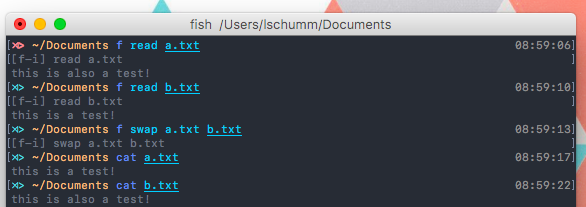

#fTerm



[]()
[](http://opensource.org/licenses/GPL-3.0)
[]()

# About

fTerm is a terminal with english syntax and natural language processing.

# How-To

To run *command* with arguments *a1, a2,...*, simply run

```
f command a1, a2,...
```

The fTerm interpreter will then attempt to interpret *command*.
First it will check if it was defined as a synonym of another, defined, command, and then do a string-based (typo-preventing) search. It will then prompt you with

```
[f-i] interpreted_command a1, a2...
```

If you enter anything (except just pressing the return key), the command will not be run.

## Examples

```
$ f list
[f-i] list⏎
a.txt
b.rst
c.mp4
$ f remove b.rst
[f-i] delete a⏎
$ f list
[f-i] list⏎
a.txt
c.mp4
```

```
$ f read a
[f-i] read a⏎
this is a test!
$ f read b
[f-i] read b⏎
this is also a test!
$ f swap a b
[f-i] swap a b⏎
[f] Swapped a and b
$ cat a
this is also a test!
$ cat b
this is a test!
```

# Commands

## swap *file1* *file2*
A function that swaps the names of two files.

## run *filename*
A universal run function; runs *filename* based on its file extension.

## size *filename*
Return the size of *filename* in human-readable format.


## delete *name*
Delete the file or directory *name*.


## list
List the files the current directory.


## read *filename*
Read *filename*.


## edit *filename*
Edit *filename*.

## commands
List all fTerm commands.

## help *command*
Return the docstring of fTerm function *command*.

## compress *filename*
Compress *filename* using the [PXZ compression utility](https://jnovy.fedorapeople.org/pxz/).

## decompress *filename*
Decompress *filename*.

## encrypt *filename*
Encrypt *filename* using the [OpenSSL encryption utility](https://www.openssl.org/).

## decompress *filename*
Decrypt *filename*.


# Installing (Mac)

First, run

```
brew tap lschumm/tap
```
and then

```
brew install fterm
```

fTerm is now installed! Verify your installation by running:
```
$ f
[f-i] Please specify a command (e.g., f swap file1 file2)
```

# Extending
See (DEVELOPERS.md)[DEVELOPERS.md] for details.

# Contributing
The fTerm project uses [gitmagic.io](https://gitmagic.io/) for pull requests. See the [contributing.json](contributing.json) file for more information.


# Notes
- Install either the *zsh* or *fish* shell. Autocomplete is **awesome**.

# Authors

* **Liam Schumm** - *Lead Developer* - [@lschumm](https://github.com/lschumm)
* **Andy Merrill** - *Idea + Developer* - [@appleinventor](https://github.com/appleinventor)
* **Jack Merrill** - *Web Developer* - [@yoshifan509](https://github.com/yoshifan509)


#  License

This project is licensed under the GNU GPL License, version 3.0 - see the [LICENSE.md](LICENSE.md) file for details
